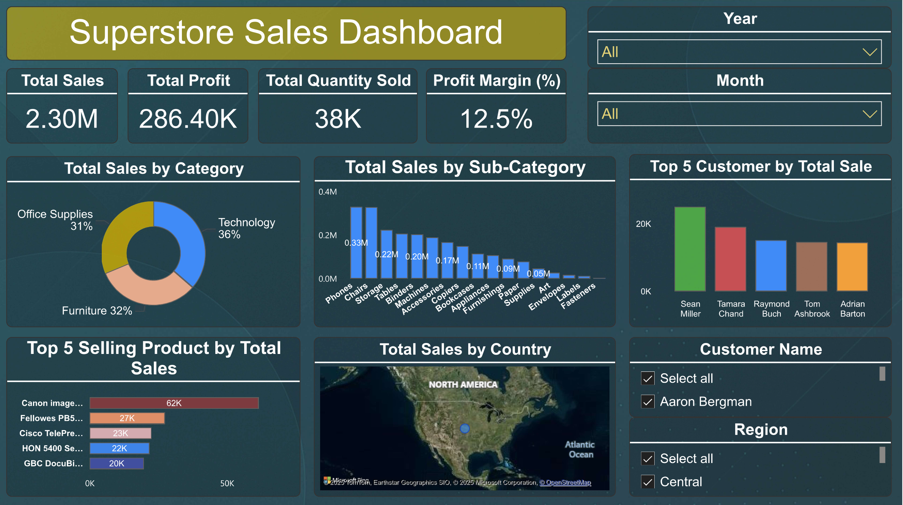

📊 Superstore Sales Dashboard 📦

This project was developed during my internship to analyze E-commerce sales data using Power BI.
The goal was to help business owners and decision-makers quickly understand:

✅ Best-selling products
✅ Sales trends (monthly/seasonal peaks)
✅ Revenue contribution by categories and regions
✅ Top customers by sales
The dashboard provides interactive filters (by year, month, region, category, etc.) and helps in data-driven decision-making.

⚙️ Steps Followed
Data Cleaning & Preparation

Fixed data types (Dates, Currency, Whole numbers, Text)
Removed duplicates and handled missing values
Created a Calendar Table for time intelligence
Data Modeling

Built relationships between Calendar and Sales data
Defined DAX measures: Total Sales, Total Profit, Profit Margin %, YTD, YoY
Visualization

KPI Cards → Sales, Profit, Margin
Line Chart → Monthly/Yearly sales trends
Bar/Treemap → Sales by Category & Sub-Category
Top-N Chart → Best-selling Products & Customers
Map → Regional Sales Distribution
Slicers → Year, Month, Region, Customer name
Insights

Sales peak during November–December (holiday season)
Technology & Office Supplies drive the most revenue
West and East regions contribute highest sales
Discounts increase sales but reduce profit margin
🧩 Features & Visualizations

🛠️ Tools & Technologies Used

Power BI: Data modeling, DAX calculations, interactive dashboards

Excel / CSV Data Source: Cleaned and transformed for analysis

Filters and Slicers:

Dynamic filters applied to KPIs for accurate metric reporting

Month and Quarter slicers for temporal analysis

💡 Purpose

This dashboard enables:

1 Real-time tracking of ecommerce metrics

2 Deeper insights into top-performing categories, states, and subcategories

🖼️ Dashboard Preview

Sales Dashboard (2)

---
🙏 Special Thanks

A special thank you to Future Interns Team for providing the opportunity to work on a real-world project and gain valuable experience in building business intelligence solutions.
//
